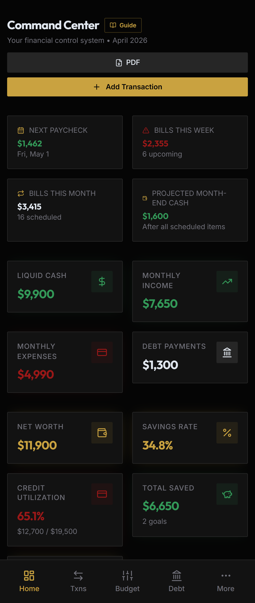
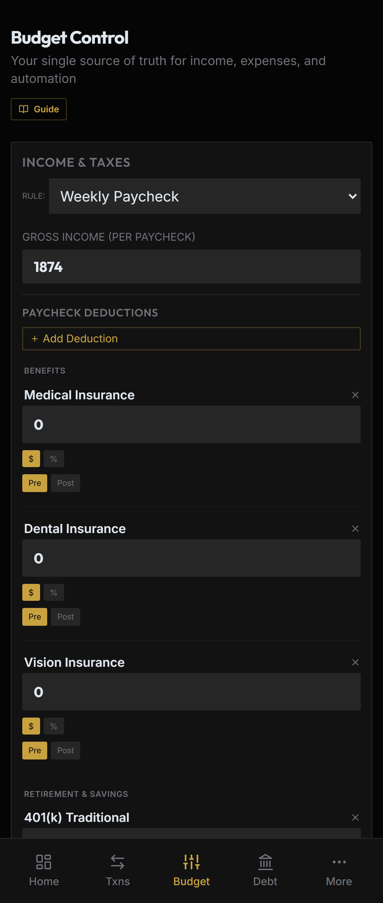
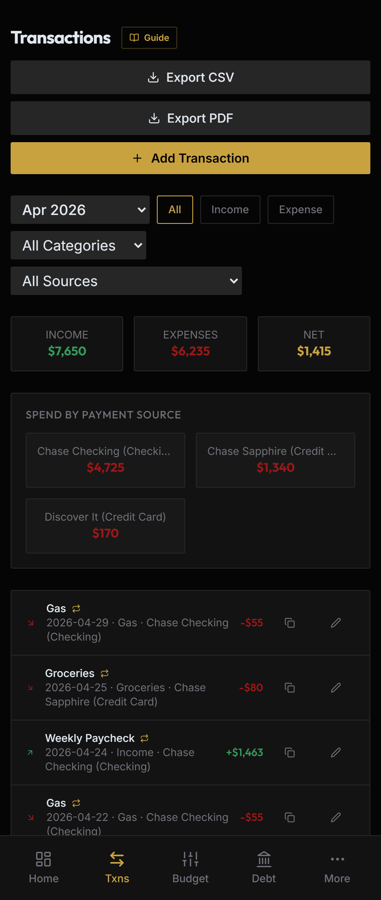
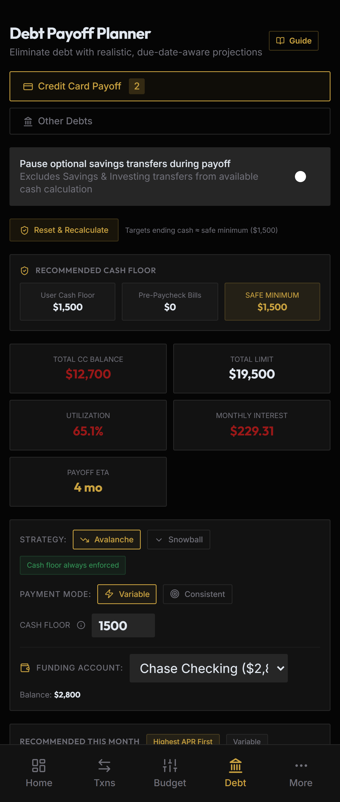
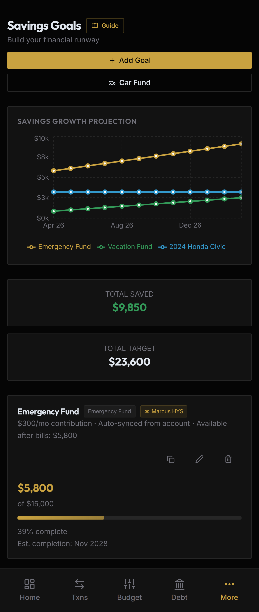
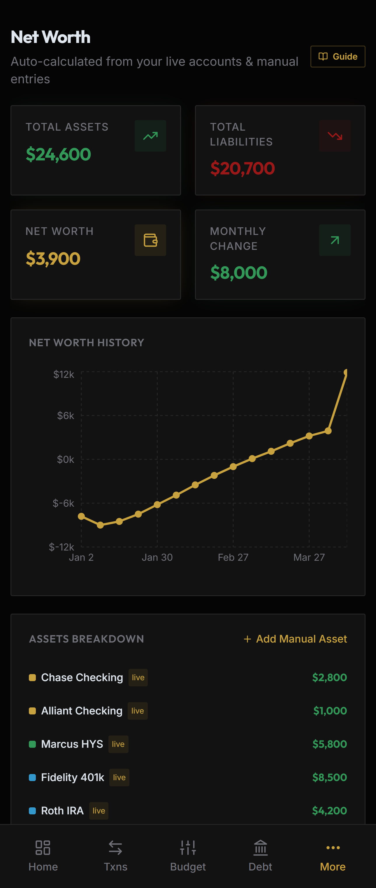
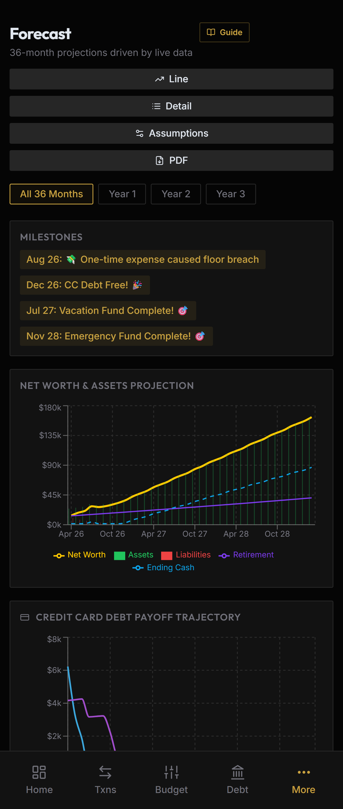
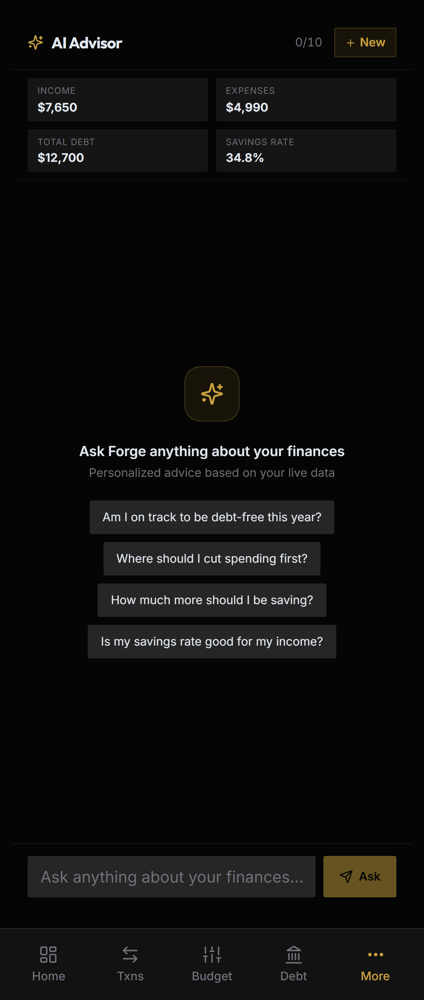

 
 

**Your money. Mastered.**

*Personal finance built for people who take their financial future seriously.*

 

---

## What is Forgenta?

Forgenta is a premium personal finance platform that gives you complete visibility and control over your money — without ads, paywalls on core features, or selling your data. Track accounts, crush debt, and build toward every financial goal from one unified dashboard.

> Available on Web, iOS, and Android.

---

## Stats

| **12+** | **100%** | **0** |
|:---:|:---:|:---:|
| Financial Tools | Free to Start | Ads. Ever. |

---

## Features

| Feature | What it does |
|---|---|
| **Cash Flow Control** | Track every dollar in and out. See your real-time financial position at a glance. |
| **Spending Analytics** | Break down expenses by category. Identify patterns. Cut waste. |
| **Debt Payoff Engine** | Snowball or avalanche — compare strategies and crush debt systematically. |
| **Savings Goals** | Set targets, track progress, and watch your financial runway grow. |
| **Car Fund Tracker** | Plan your next vehicle purchase with precision. Know your numbers. |
| **Premium Export Tools** | Advanced CSV exports, unlimited transaction history, and pro-level analytics. |

---

## Three Pillars

**Track** — Every account, goal, and payment in one dashboard.

**Secure** — Bank-level encryption. Multi-factor authentication. Your data is never sold.

**Automate** — Recurring rules, paycheck scheduling, auto-projection.

---

## Screenshots

| Dashboard | Budget | Transactions |
|:---:|:---:|:---:|
|  |  |  |
| *Real-time net worth + cash flow* | *Monthly budget breakdown* | *Full transaction history* |

| Debt Payoff Engine | Savings Goals | Net Worth |
|:---:|:---:|:---:|
|  |  |  |
| *Snowball vs. avalanche comparison* | *Goal tracking + runway projection* | *Historical net worth chart* |

| Forecast | AI Advisor |
|:---:|:---:|
|  |  |
| *Paycheck-based cash flow projection* | *Personalized financial guidance* |

---

## Tech Stack

---

## Get Started

**Web** — Visit [getforgenta.com](https://getforgenta.com) and sign up free. No credit card required.

**iOS / Android** — Download from the App Store or Google Play (links coming at launch).

---

## Security

Forgenta handles sensitive financial data. Security is non-negotiable.

- Row-Level Security (RLS) enforced at the database layer via Supabase
- All secrets managed via environment variables — never committed
- Multi-factor authentication supported for all accounts
- Bank connections powered by Plaid — credentials never touch our servers

---

---

&copy; 2025 TRE Forged LLC. All rights reserved.

Forgenta&trade; is a trademark of TRE Forged LLC.

*Built in Florida.*

