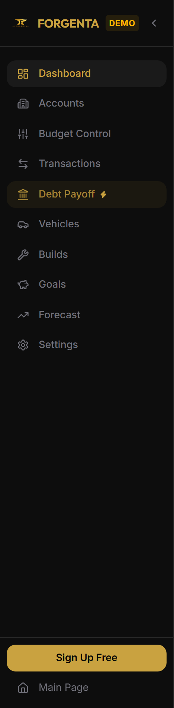
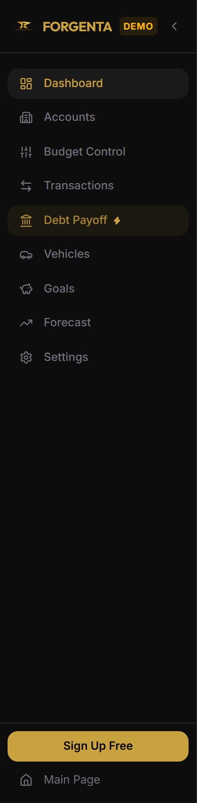
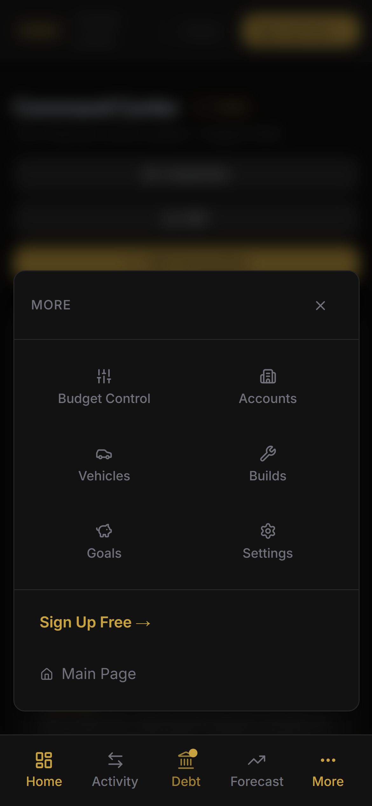
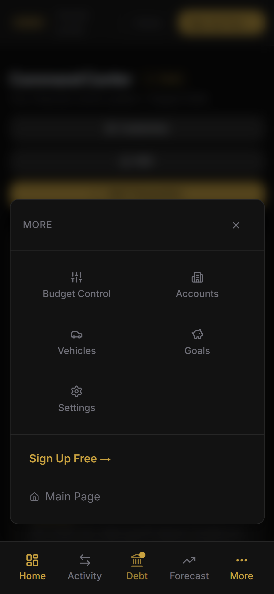
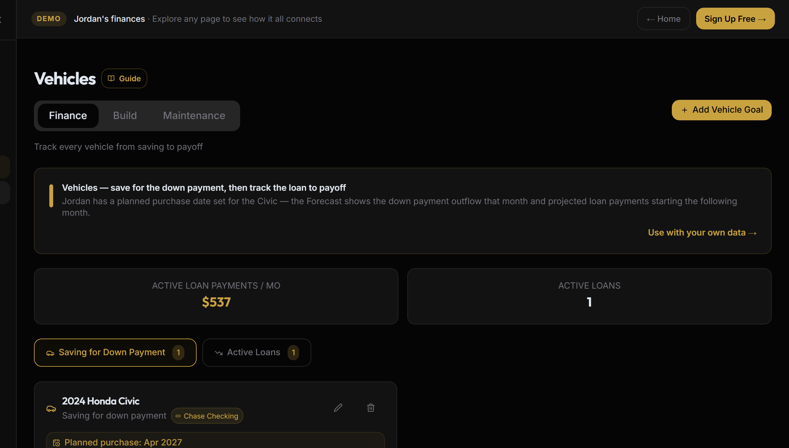

# Proposal — should any tabs be combined?

**Status: proposal only. This branch changes no application code.** Nothing in `src/` is
touched. The images in `nav-consolidation/` are real screenshots of the running app (demo
mode) for "before", and mockups produced by editing the DOM of those same running
components for "after".

## The test used

Each tab was judged by **the question a person has in their head when they tap it**, not by
which table the data lives in. Two consequences, both of which cut against merging for its
own sake:

- Two tabs answering the same question is how the one nobody opens goes stale.
- One tab answering two unrelated questions is worse than either tab alone.

So the bar for a merge is: *same question, or same object at different points in its life.*
Everything else stays put.

## What each tab is actually asked

| Tab | The question |
|---|---|
| Dashboard | How am I doing right now? |
| Accounts | What are my balances, and is my bank still connected? |
| Budget Control | What is my monthly plan — in, out, fixed, variable, transfers? |
| Transactions | What actually happened, and which charges still need a decision? |
| Debt Payoff | When am I debt-free, and what should I pay next? |
| Vehicles | Can I afford this car, and when does the loan end? |
| Builds | What has this car project cost, and when is the next service? |
| Goals | Am I on track for my savings targets? |
| Forecast | Where will my cash and net worth be over the next 60 months? |
| Settings | — |
| Upgrade | — (a sales page) |

## Recommendation

**One merge, one demotion. 11 nav entries → 9.** The honest answer to "should some tabs be
combined" is that exactly one pair genuinely should; the rest are correctly separate and the
reasoning for leaving them is below, because "we looked and decided no" is itself the useful
half of this review.

---

### ✅ MERGE — `Vehicles` + `Builds` → one **Vehicles** tab

**Before / after, desktop rail:**

| before | after |
|---|---|
|  |  |

**Before / after, mobile "More" panel:**

| before | after |
|---|---|
|  |  |

**Why.** These two tabs are the same object at two points in its life: a car you are saving
for becomes a car you owe on becomes a car you modify and service. Forgenta's own copy on
the Vehicles page already frames it that way — *"Track every vehicle from saving to payoff"*
— and the merge just extends that sentence past payoff, which is where Builds lives.

**The evidence that this split is the data model's and not the user's:** `CarBuild` in
`src/lib/types.ts:166` carries its own `name`, `year`, `make`, `model` and has **no foreign
key to `CarFund` at all**. The two tables never reference each other. So a person who is
financing a car and building that same car **enters the same physical vehicle twice, in two
tabs, and the app has no idea they are the same car.** That is the tell. One noun, one tab.

**It is also the stale-tab case in practice.** A build is opened constantly during a build
and roughly never afterwards; a vehicle loan is opened when something about the loan
changes. Separately, each is dark most of the year. Together, one tab is the place you go
about your car.

**The objection, and the answer.** "Can I afford this?" and "what has this project cost?" are
not the same question, and a merged tab that shows both at once would be exactly the failure
mode this review is supposed to prevent. So the merge keeps them separated **one level
down**, in the sub-tab pattern the app already uses on Budget Control:

*(mockup — the real Vehicles page with a proposed `Finance · Build · Maintenance` strip
injected, using Budget Control's own `TabsList` styling)*

- **Finance** — today's Vehicles page: down-payment saving, loan, amortization, payoff.
- **Build** — today's Builds page: phases, items, cost, photos, share link.
- **Maintenance** — the maintenance log, which already lives under Builds.

**Cost, stated honestly.** This is the largest of the options on the table, not a nav edit.
It needs a link between a build and a vehicle (nullable `car_builds.car_fund_id`, so
standalone builds keep working), a per-vehicle selector, and the two pages re-homed under
one route. **The nav change alone, without the join, would be cosmetic** — two unrelated
lists behind one tab, which is the bad merge. Recommend doing it properly or not at all.

---

### ✅ DEMOTE — `Upgrade` out of the nav list into the sidebar footer

A permanent nav row spending a slot on a sales page, for a page opened once ever. **Mobile
already does this** — `MobileNav.tsx:124` puts "Upgrade to Premium" in the More panel's
footer next to Sign Out, not in the tab grid. The desktop rail is the inconsistent one.
Moving it to the footer beside Sign Out costs a paying user nothing (it is already hidden
for them, `Sidebar.tsx:72`) and makes the two navigations agree.

*Not visible in the screenshots above: demo mode hides `/premium` entirely, so neither the
before nor the after shot contains this row.*

---

## Deliberately left alone

**`Budget Control` and `Debt Payoff`** — Budget Control's `debt` tab holds recurring debt
*rules* (what leaves the account each month); Debt Payoff runs the payoff engine (what order,
how long). The first is an input to the second. They read as duplicates from the outside and
are not: one is the plan, the other is the consequence. Merging would also bury the app's
flagship surface, which is the only nav item carrying `highlight: true`.

**`Accounts` and `Transactions`** — the obvious overlap would be sync status, and it is not
duplicated: Accounts owns the Plaid connection and "Updated 3 hours ago"
(`Accounts.tsx:108`), Transactions owns what came through the pipe. "Is my bank connected?"
and "what did my bank report?" are different questions asked at different moments.

**`Budget Control` and `Transactions`** — plan versus actuals. Adjacent, constantly compared,
and still two questions: "what should happen every month" and "did this specific charge get
categorized". Also the two largest pages in the app (1,766 and 1,028 lines); merging them
buys nothing and costs a lot.

**`Goals` and `Vehicles`** — a car fund *is* a savings goal, so this looked like the second
merge. It is already handled correctly: Goals cross-links to Vehicles with a pointer strip
(`SavingsGoals.tsx:636`) rather than duplicating the car funds. A link where a duplicate
would do is the right answer and it is already there.

**`Goals` and `Forecast`** — both project forward, so both answer "where will I be". But
Goals is where goals are *created and edited* and Forecast is read-only. A management surface
and a projection surface are different jobs. Worth noting one real overlap for a separate
look: retirement is projected in Forecast's milestones panel *and* is a goal type in Goals
(`ROTH_IRA_LIMIT`, `SavingsGoals.tsx:27`) — that is two surfaces answering "am I on track for
retirement", and it is the shape that drifts. Not a nav problem; flagged here because this
review is where it surfaced.

**`Dashboard`** — a digest of everything, which is a real job and not a duplicate of the
pages it summarizes.

## If only one thing is done

Do the Vehicles + Builds merge, with the `car_fund_id` join. The Upgrade demotion is a
two-line change that can ride along with anything.
